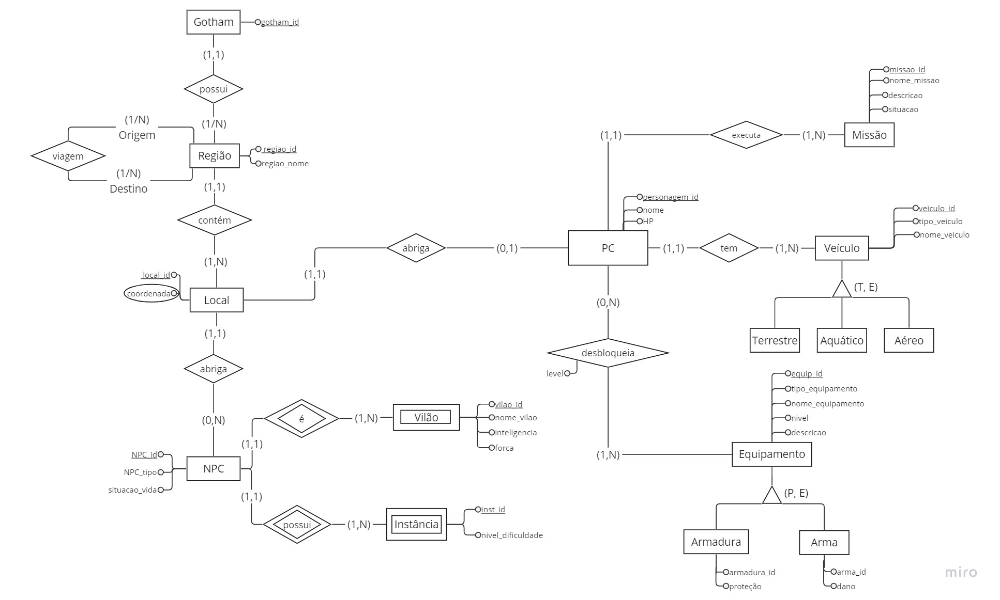
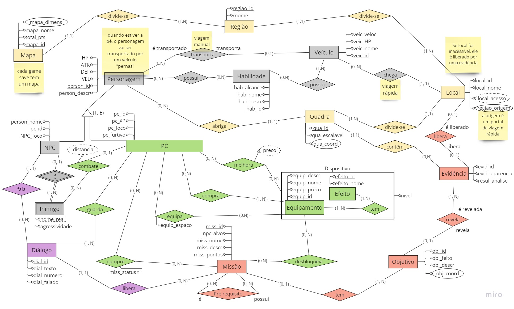

# DER - DIAGRAMA ENTIDADE E RELACIONAMENTO

O Modelo Entidade Relacionamento, mais conhecido como MER, é um modelo conceitual importante para projetar sistemas de banco de dados de maneira eficaz e entender como as entidades (objetos ou conceitos) estão interconectadas. Sendo usado como base para o nosso trabalho sobre o jogo Batman Arkham Knight da disciplina de Banco de Dados 1, ministrada pelo professor Maurício Serrano.  

## DER - Batman Arkham Knight

Abaixo seguem os Diagramas Entidade Relacionamento, com suas respectivas versões:

**Imagem 1** - Diagrama Entidade Relacionamento Batman Arkham Knight.

**Fonte:** Autores.

**Imagem 2** - Segunda versão do Diagrama Entidade Relacionamento Batman Arkham Knight..

**Fonte:** Autores.

## Entidades

Segue a baixo a descrição de cada entidade.

| **Entidade** | **Descrição** |
| ------------ | ------------- |
| Mapa         | Localidade onde se encontra tudo o que acontece dentro do jogo. |
| Região       | Superfície terrestre que apresenta características naturais e específicas. |
| Local        | Localidade da Região. |
| Quadra       | Específicação dentro de Local, com coordenadas. |
| Personagem   | Personagens sem ser o PC. |
| NPC          | Personagem dentro do jogo que não é controlado por um player. |
| Inimigo      | Personagem que atua como um adversário do protagonista. |
| Habilidade   |               |
| Veículo      | Um meio de transporte utilizado pelo PC dentro do jogo para se locomover. |
| PC           |               |
| Equipamento  |               |
| Efeito       |               |
| Diálogo      |               |
| Missão       |               |
| Objetivo     |               |
| Evidência    |               |

### Gotham

- *Descrição:* Localidade onde se encontra tudo o que acontece dentro do jogo.

### Região

- *Descrição:* Superfície terrestre que apresenta características naturais e específicas.

### Viagem

- *Descrição:* Viagem que o PC faz entre regiões para se locomover de maneira mais rápida.

### Local

- *Descrição:* Lugar específico em uma determinada área geográfica.

### NPC

- *Descrição:* Personagem dentro do jogo que não é controlado por um player. 

### Vilão

- *Descrição:* Personagem que atua como um adversário/inimigo do protagonista.

### Instância

- *Descrição:* Representa um "Personagem Não Jogável" (NPC) específico dentro do jogo.

### PC

- *Descrição:* personagem dentro do jogo que é controlado e manipulado diretamente pelo player.

### Missão

- *Descrição:* Uma tarefa ou objetivo específico designado dentro do jogo para que o PC complete.

### Veículo

- *Descrição:* Um meio de transporte utilizado pelo PC dentro do jogo para se locomover. 

### Equipamento

- *Descrição:*  Itens, dispositivos ou armaduras específicas usados pelo PC para utilizar em combates ou outras situações. 

### Pre requisito

- *Descrição:* pré requisitos e requisitos que uma missão pode ser para liberar alguma outra na qual o PC precisa para continuar a história. 

## Relacionamentos

### Gotham x Região

- *Relacionamentos:* Gotham possui regiões, onde dentro dessas regiões é possível fazer viagens para uma locomoção mais rápida pelo mapa.

### Região x Local

- *Relacionamentos:* Região contém locais específicos.

### Região x Viagem

- *Relacionamentos:* Viagem é feita entre regiões para uma locomoção mais rápida.

### Local x NPC

- *Relacionamentos:* Local abriga NPCs; possui as coordenadas de NPCs; está em uma região.

### NPC x Vilão

- *Relacionamentos:* NPC é/pode ser um vilão; tem inteligência e força.

### NPC x Instância

- *Relacionamentos:* NPC possui instância; possui nivél de dificuldade.

### Local x PC

- *Relacionamentos:* Local abriga PC; possui as coordenadas de PC; está em uma região.

### PC x Missão

- *Relacionamentos:* PC possui missão; ocorre em Gotham.

### PC x Veículo

- *Relacionamentos:* PC possui veículo; ocorre em Gotham; Se locomove dentro de Gotham.

### PC x Equipamento

- *Relacionamentos:* PC possui equipamento; existem diferentes equipamentos;

### Missão x Pre requisito

- *Descrição:* Missão possui pré requisitos para outra missão; é pré requisito para outra missão; PC que completa essas missões.

## Histórico de versões

| Versão |    Data    | Descrição                                           | Autor                                          |
| :----: | :--------: | --------------------------                          | ---------------------------------------------- |
| `1.0`  | 25/09/2023 | Criação do DER                                      | Todos  |
| `1.1`  | 01/10/2023 | Revisão                                             | Todos  |
| `2.0`  | 01/12/2023 | Segunda versão                                      | João Pedro (https://github.com/JoosPerro)      |
