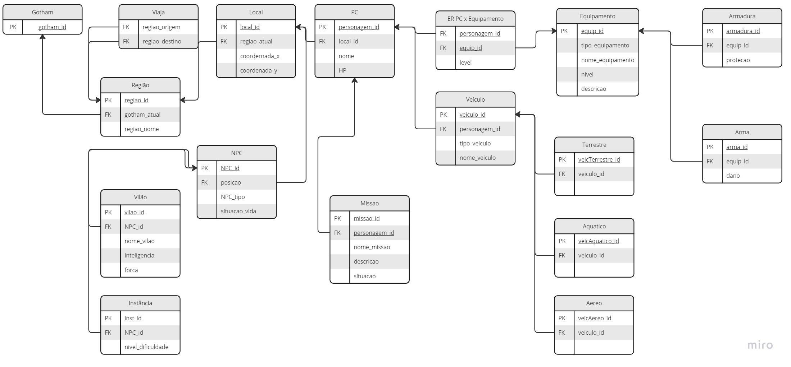
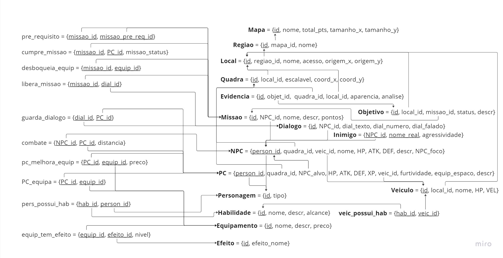

# MER - Modelo Entidade Relacionamento

O Modelo Entidade Relacionamento, mais conhecido como MER, é um modelo conceitual importante para projetar sistemas de banco de dados de maneira eficaz e entender como as entidades (objetos ou conceitos) estão interconectadas. Sendo usado como base para o nosso trabalho sobre o jogo Batman Arkham Knight da disciplina de Banco de Dados 1, ministrada pelo professor Maurício Serrano.  

## Modelo Relacional

**Imagem 1** - Modelo Relacional Batman Arkham Knight.

**Fonte:** Autores

**Imagem 2** - Modelo Relacional Atualizado Batman Arkham Knight.

**Fonte:** Autores

## Histórico de versões

| Versão |    Data    | Descrição                                           | Autor                                          |
| :----: | :--------: | --------------------------                          | ---------------------------------------------- |
| `1.0`  | 25/09/2023 | Criação do MER                                      | Todos  |
| `1.1`  | 01/10/2023 | Revisão                                   | [Luis Miranda](https://github.com/LuisMiranda10)  |
| `1.2`  | 03/12/2023 | Atualização                                   | [Milena Baruc](https://github.com/MilenaBaruc)  |
